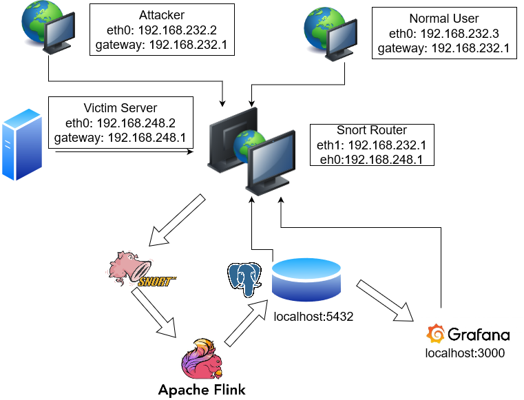
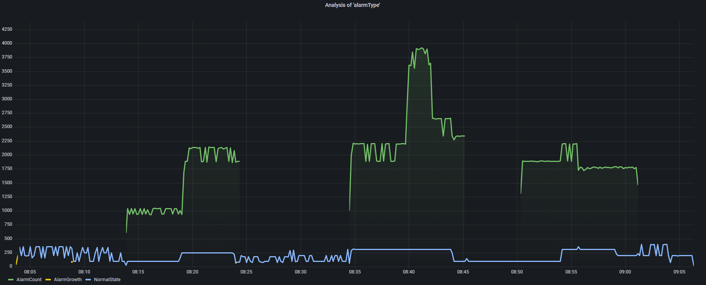

# O projekcie
Tematem projektu jest system monitorowania ruchu sieciowego.
W ramach projektu utworzono architekturę zgodna z poniższym schematem

## Budowa mechanizmu generowania ruchu 
W ramach realizacji mechanizmów generowania ruchu sieciowego 
stworzono scenariusz ataków DoS w trakcie normalnego używania sieci.
Skrypty załączono w plikach: attacker.sh, normal.sh <br/>
Attacker.sh:
```bash
#!/bin/bash
hping3 -i u100000 -S -c 3000 -p 80 192.168.248.2 &&
hping3 -i u100000 -S -c 3000 -p 80 -2 192.168.248.2 &&
hping3 -i u10000 -S -c 30000 -p 80 -1 192.168.248.2 &&
hping3 -i u10000 -S -c 30000 -p 80 192.168.248.2 &&
hping3 -i u100000 -S -c 3000 -p 80 -2 192.168.248.2 &&
hping3 -i u100000 -S -c 3000 -p 80 -1 192.168.248.2 &&
hping3 -i u10000 -S -c 30000 -p 80 192.168.248.2 &&
hping3 -i u5000 -S -c 24000 -p 80 192.168.248.2 &&
hping3 -i u8000 -S -c 22500 -p 80 192.168.248.2 &&
hping3 -i u100000 -S -c 3000 -p 80 -2 192.168.248.2 &&
hping3 -i u10000 -S -c 30000 -p 80 192.168.248.2 &&
hping3 -i u5000 -S -c 60000 -p 80 -1 192.168.248.2 &&
hping3 -i u100000 -S -c 3000 -p 80 192.168.248.2 ;
```
Normal.sh:
```bash
#!/bin/bash
hping3 -i u125000 -S -c 2400 -p 80 192.168.248.2 &&
hping3 -i u80000 -S -c 3750 -p 80 192.168.248.2 &&
hping3 -i u100000 -S -c 3000 -p 80 -1 192.168.248.2 &&
hping3 -i u80000 -S -c 3750 -p 80  192.168.248.2 &&
hping3 -i u125000 -S -c 2400 -p 80 -2 192.168.248.2 &&
hping3 -i u100000 -S -c 3000 -p 80 192.168.248.2 &&
hping3 -i u64000 -S -c 9375 -p 80 192.168.248.2 &&
hping3 -i u100000 -S -c 6000 -p 80 -1 192.168.248.2 &&
hping3 -i u64000 -S -c 4688 -p 80 192.168.248.2 &&
hping3 -i u100000 -S -c 3000 -p 80 192.168.248.2 ;
```
## Analiza ruchu
Analiza ruchu odbywala się z wykorzystaniem mechanizmów dostepnych w Apache Flink
(Watermark, windows, WindowsFunction).
### Odczytywanie logow systemu Snort
Logi systemu snorta odczytywano z pliku alert.csv
### Analizowane wielkosci
Analizowany była liczba pakietów na sekunde, grupowana po ich źródle, porcie docelowym,
czy po rodzaju protokołu
### Wykrywane anomalie
Wykrywano nagły wzorst liczby pakietów
(tj. gdy ruch wzrósł n-krotnie w stosunku do poprzedniego okna czasowego)
oraz gdy liczba pakietów przekraczała zdefiniowany limit. 

### Zapis danych
Zapis danych odbywa się do tabeli PostgreSQL.

## Srodowisko prezentacji danych
W ramach prezentacji danych wybrano środowisko Grafana. Poniżej
przedstawiono wykres uzyskany w tym środowisku. 


# Konfiguracja
W celu konfiguracji projektu zależy zadbać o odtworzenie
architektury rozwiązania. 
Dodatkowo samo uruchomienie projektu (przy założeniu posiadania odpowiedniego
pliku z logami) wymagać będzie:
* Java 8 lub Java 11
* [Apache Flink](https://nightlies.apache.org/flink/flink-docs-release-1.14/docs/try-flink/local_installation/)
* [Maven](https://maven.apache.org/guides/getting-started/maven-in-five-minutes.html)

Dodatkowo nalezy zadbać o skonfigurowanie bazy PostgreSQL, do tego wymagane są sterowniki dla wersji 42.3.5 PostgreSQL z rozszerzeniem .jar w lokalizacji: /opt/flink/lib/
Przy założeniu posiadaniu odpowiednich dependencji uruchamianie aplikacji Flinka
odbywa się zgodnie z [instrukcją](https://nightlies.apache.org/flink/flink-docs-release-1.14/docs/try-flink/local_installation/#starting-and-stopping-a-local-cluster)

# Autorzy
Arkadiusz Rybski <br>
Krystian Szewczak